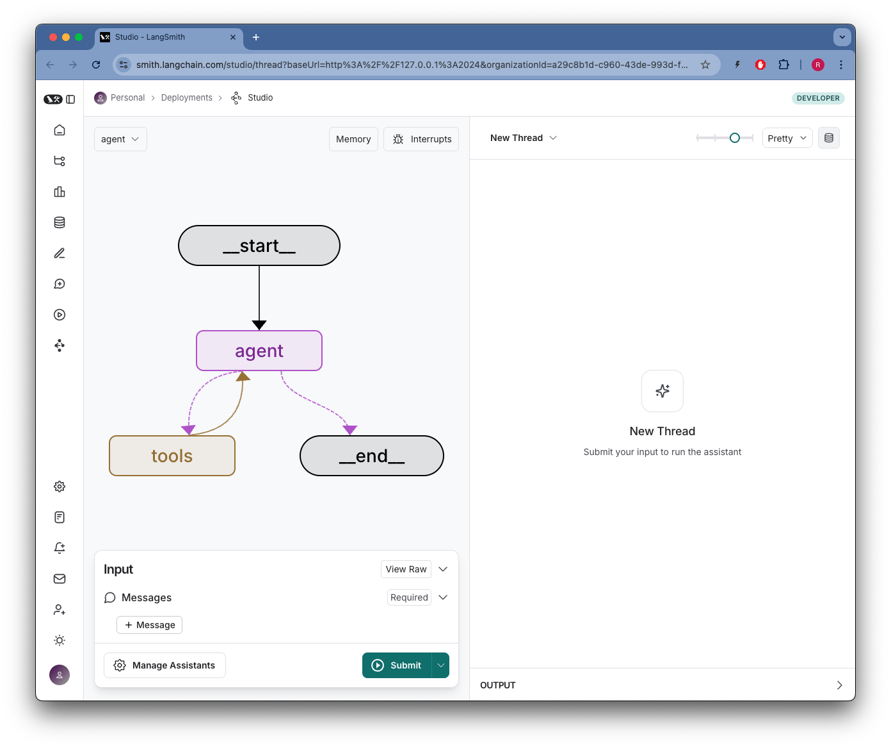

# langchain-box-mcp-adapter

This sample project implements the Langchain MCP adapter to the Box MCP server. It demonstrates how to integrate Langchain with a Box MCP server using tools and agents.

## Features

- **Langchain Integration**: Utilizes Langchain's `ChatOpenAI` model for AI interactions.
- **MCP Server Communication**: Connects to the Box MCP server using `stdio` transport.
- **Tool Loading**: Dynamically loads tools from the MCP server.
- **Agent Creation**: Creates a React-style agent for handling user prompts and tool interactions.
- **Rich Console Output**: Provides a user-friendly console interface with markdown rendering and typewriter effects.

## Requirements

- Python 3.13 or higher
- Dependencies listed in `pyproject.toml`:
  - `box-ai-agents-toolkit>=0.0.38`
  - `langchain-mcp-adapters>=0.0.8`
  - `langchain-openai>=0.3.12`
  - `langgraph>=0.3.29`
  - `rich>=14.0.0`

## Setup

1. Clone the repository:

   ```bash
   git clone <repository-url>
   cd langchain-box-mcp-adapter
2. Install dependencies:

    ```bash
    uv sync
    ```

3. Create a `.env` file in the root of the project and fill in the information.
```yaml
LANGSMITH_TRACING = "true"
LANGSMITH_API_KEY =
OPENAI_API_KEY =

BOX_CLIENT_ID = ""
BOX_CLIENT_SECRET = ""
BOX_SUBJECT_TYPE = "user"
BOX_SUBJECT_ID = ""
```

3. Ensure the MCP server is set up and accessible at the specified path in the project.


4. Update the StdioServerParameters in src/simple_client.py or src/graph.py with the correct path to your MCP server script.
```python
    server_params = StdioServerParameters(
        command="uv",
        args=[
            "--directory",
            "/your/absolute/path/to/the/mcp/server/mcp-server-box",
            "run",
            "src/mcp_server_box.py",
        ],
    )
```

## Usage
### Running the Simple Client
To run the simple client:

```bash
uv run src/simple_client.py
```

This will start a console-based application where you can interact with the AI agent. Enter prompts, and the agent will respond using tools and AI capabilities.

### Running the Graph-Based Agent (LangGraph)
The graph-based agent can be used by invoking the make_graph function in src/graph.py. This is useful for more complex workflows.
```bash
uv run langgraph dev --config src/langgraph.json
```
You should see something like:


## Project Structure
- src/simple_client.py: Main entry point for the simple client.
- src/graph.py: Contains the graph-based agent setup.
- src/console_utils/console_app.py: Utility functions for console interactions.
- src/langgraph.json: Configuration for the LangGraph integration.

## License
This project is licensed under the MIT License. See the [LICENSE](./LICENSE) file for details.

## Contributing
Contributions are welcome! Please open an issue or submit a pull request for any improvements or bug fixes.

